# Architecture Diagrams (Mermaid)

## 1. Multi-User OAuth 2.0 Complete Flow

```mermaid
sequenceDiagram
    participant Alice as 👤 Alice<br/>(Browser)
    participant NextJS as 🌐 Next.js<br/>Frontend
    participant OMA as 🔐 OMA Backend<br/>(FastAPI)
    participant DB as 💾 PostgreSQL<br/>Database
    participant Google as 🔑 Google<br/>OAuth
    participant MCP as 🤖 MCP Google<br/>Hub

    rect rgb(200, 220, 240)
        Note over Alice,DB: Phase 1: User Registration & Login
        Alice->>NextJS: Register (alice@example.com)
        NextJS->>OMA: POST /auth/register
        OMA->>DB: INSERT INTO users<br/>(uuid-A, alice@...)
        DB-->>OMA: ✅ User created
        OMA-->>NextJS: ✅ Registration success

        Alice->>NextJS: Login (alice@example.com)
        NextJS->>OMA: POST /auth/login
        OMA->>DB: SELECT * FROM users<br/>WHERE email=alice@...
        DB-->>OMA: User record (uuid-A)
        OMA->>OMA: Generate JWT-ALICE<br/>(payload: {sub: uuid-A})
        OMA-->>NextJS: {access_token: JWT-ALICE}
        NextJS-->>Alice: ✅ Logged in<br/>(JWT-ALICE stored in cookie)
    end

    rect rgb(220, 240, 200)
        Note over Alice,Google: Phase 2: Connect Google Account
        Alice->>NextJS: Click "Connect Google"
        NextJS->>OMA: GET /google/auth/url<br/>Authorization: Bearer JWT-ALICE
        OMA->>OMA: Decode JWT-ALICE → user_id=uuid-A
        OMA->>OMA: Generate state token:<br/>{user_id: uuid-A, csrf_token}
        OMA-->>NextJS: {auth_url, state}
        NextJS-->>Alice: Redirect to Google OAuth

        Alice->>Google: Authorize MCP App
        Google-->>Alice: Redirect to callback URL<br/>?code=xxx&state=yyy
        Alice->>OMA: GET /auth/callback<br/>?code=xxx&state=yyy

        OMA->>OMA: Validate state token
        OMA->>OMA: Extract user_id=uuid-A from state
        OMA->>Google: POST /token<br/>(exchange code for tokens)
        Google-->>OMA: {access_token, refresh_token}
        OMA->>OMA: Encrypt tokens (AES-256)
        OMA->>DB: INSERT INTO google_credentials<br/>(user_id=uuid-A, encrypted tokens)
        DB-->>OMA: ✅ Credentials stored
        OMA-->>Alice: Redirect to /?google_connected=true
    end

    rect rgb(240, 220, 200)
        Note over MCP,Google: Phase 3: MCP Hub Uses Google API
        MCP->>MCP: Load .env<br/>OMA_ACCESS_TOKEN=JWT-ALICE
        MCP->>OMA: GET /google/credentials<br/>Authorization: Bearer JWT-ALICE
        OMA->>OMA: Decode JWT-ALICE → user_id=uuid-A
        OMA->>DB: SELECT * FROM google_credentials<br/>WHERE user_id=uuid-A
        DB-->>OMA: Encrypted credentials (Alice's)
        OMA->>OMA: Decrypt tokens
        OMA->>OMA: Check expiry, refresh if needed
        OMA-->>MCP: {access_token, refresh_token}

        MCP->>Google: Gmail API call<br/>Authorization: Bearer Alice's token
        Google-->>MCP: Alice's Gmail data
    end

    Note over Alice,MCP: 🔒 Data Isolation: Each user has separate JWT and Google tokens
```



## 2. Multi-User Data Isolation

```mermaid
graph TB
    subgraph "👥 Users"
        Alice[👤 Alice<br/>alice@example.com]
        Bob[👤 Bob<br/>bob@example.com]
        Carol[👤 Carol<br/>carol@example.com]
    end

    subgraph "🔐 JWT Tokens"
        JWT_A[JWT-ALICE<br/>payload: {sub: uuid-A}]
        JWT_B[JWT-BOB<br/>payload: {sub: uuid-B}]
        JWT_C[JWT-CAROL<br/>payload: {sub: uuid-C}]
    end

    subgraph "💾 Database"
        subgraph "users table"
            User_A[(uuid-A<br/>alice@example.com)]
            User_B[(uuid-B<br/>bob@example.com)]
            User_C[(uuid-C<br/>carol@example.com)]
        end

        subgraph "google_credentials table"
            Cred_A[(user_id: uuid-A<br/>🔒 encrypted tokens A)]
            Cred_B[(user_id: uuid-B<br/>🔒 encrypted tokens B)]
            Cred_C[(user_id: uuid-C<br/>🔒 encrypted tokens C)]
        end
    end

    subgraph "🔑 Google OAuth"
        Google_A[Alice's Gmail Account]
        Google_B[Bob's Gmail Account]
        Google_C[Carol's Gmail Account]
    end

    Alice -->|Login| JWT_A
    Bob -->|Login| JWT_B
    Carol -->|Login| JWT_C

    JWT_A -.->|Identifies| User_A
    JWT_B -.->|Identifies| User_B
    JWT_C -.->|Identifies| User_C

    User_A ---|FK| Cred_A
    User_B ---|FK| Cred_B
    User_C ---|FK| Cred_C

    Cred_A -->|Decrypted<br/>Access| Google_A
    Cred_B -->|Decrypted<br/>Access| Google_B
    Cred_C -->|Decrypted<br/>Access| Google_C

    style Alice fill:#e1f5ff
    style Bob fill:#ffe1e1
    style Carol fill:#e1ffe1
    style JWT_A fill:#e1f5ff
    style JWT_B fill:#ffe1e1
    style JWT_C fill:#e1ffe1
    style Cred_A fill:#e1f5ff
    style Cred_B fill:#ffe1e1
    style Cred_C fill:#e1ffe1
```

## 3. System Architecture Overview

```mermaid
graph LR
    subgraph "Client Layer"
        Browser[🌐 Web Browser<br/>Next.js Frontend]
        MCP_A[🤖 MCP Hub<br/>Alice's Instance]
        MCP_B[🤖 MCP Hub<br/>Bob's Instance]
    end

    subgraph "Authentication Layer"
        OMA[🔐 OMA Backend<br/>FastAPI<br/>OAuth Management]
    end

    subgraph "Storage Layer"
        DB[(💾 PostgreSQL<br/>- users<br/>- google_credentials<br/>- refresh_tokens)]
    end

    subgraph "External Services"
        Google[🔑 Google OAuth 2.0<br/>- Gmail API<br/>- Calendar API<br/>- Drive API]
    end

    Browser -->|1. Login/Register| OMA
    Browser -->|2. Connect Google| OMA
    OMA -->|Store encrypted<br/>credentials| DB
    OMA <-->|OAuth Flow| Google

    MCP_A -->|JWT-ALICE<br/>Get credentials| OMA
    MCP_B -->|JWT-BOB<br/>Get credentials| OMA

    OMA -->|Query by<br/>user_id| DB

    MCP_A -->|Alice's token<br/>API calls| Google
    MCP_B -->|Bob's token<br/>API calls| Google

    style Browser fill:#e1f5ff
    style MCP_A fill:#e1f5ff
    style MCP_B fill:#ffe1e1
    style OMA fill:#fff4e1
    style DB fill:#f0f0f0
    style Google fill:#e8f5e9
```



## 4. MCP Hub Authentication Modes

```mermaid
graph TB
    Start[Start MCP Hub]
    CheckMode{AUTH_MODE<br/>environment<br/>variable}

    subgraph "OMA Backend Mode (Recommended)"
        OMA_Check{OMA_ACCESS_TOKEN<br/>set?}
        OMA_Connect[Connect to<br/>OMA Backend]
        OMA_Fetch[GET /google/credentials<br/>with JWT token]
        OMA_Response[Receive Google<br/>OAuth tokens]
        OMA_Build[Build Google API<br/>credentials object]
    end

    subgraph "Local File Mode (Legacy)"
        File_Check{Token file<br/>exists?}
        File_Load[Load from<br/>token.json]
        File_OAuth[Interactive<br/>OAuth flow]
        File_Save[Save to<br/>token.json]
    end

    Ready[✅ Ready to use<br/>Google APIs]

    Start --> CheckMode
    CheckMode -->|oma_backend| OMA_Check
    CheckMode -->|local_file| File_Check

    OMA_Check -->|Yes| OMA_Connect
    OMA_Check -->|No| Error1[❌ Error:<br/>OMA_ACCESS_TOKEN required]

    OMA_Connect --> OMA_Fetch
    OMA_Fetch --> OMA_Response
    OMA_Response --> OMA_Build
    OMA_Build --> Ready

    File_Check -->|Yes| File_Load
    File_Check -->|No| File_OAuth
    File_OAuth --> File_Save
    File_Load --> Ready
    File_Save --> Ready

    style OMA_Build fill:#d4edda
    style Ready fill:#d4edda
    style Error1 fill:#f8d7da
```



## 5. Database Schema

```mermaid
erDiagram
    users ||--o{ refresh_tokens : "has many"
    users ||--o| google_credentials : "has one"

    users {
        uuid id PK
        varchar username UK
        varchar email UK
        varchar hashed_password
        boolean is_active
        timestamp created_at
        timestamp updated_at
    }

    refresh_tokens {
        serial id PK
        uuid user_id FK
        text token
        timestamp expires_at
        timestamp created_at
    }

    google_credentials {
        serial id PK
        uuid user_id FK,UK
        text access_token "🔒 AES-256 encrypted"
        text refresh_token "🔒 AES-256 encrypted"
        timestamp token_expiry
        text[] scopes
        timestamp created_at
        timestamp updated_at
    }
```



## 6. Token Flow Diagram

```mermaid
flowchart TD
    User[👤 User]

    subgraph "Token Types"
        JWT[🎫 JWT Token<br/>OMA Backend<br/>Lifetime: 30 min]
        Refresh[🔄 Refresh Token<br/>OMA Backend<br/>Lifetime: 7 days]
        GoogleAccess[🔑 Google Access Token<br/>Google OAuth<br/>Lifetime: 1 hour]
        GoogleRefresh[🔄 Google Refresh Token<br/>Google OAuth<br/>No expiry]
    end

    User -->|1. Login| JWT
    JWT -->|2. Expires after 30min| Refresh
    Refresh -->|3. Get new JWT| JWT

    JWT -->|4. Get Google creds| GoogleAccess
    GoogleAccess -->|5. Expires after 1h| GoogleRefresh
    GoogleRefresh -->|6. Refresh| GoogleAccess

    GoogleAccess -->|7. API calls| API[📧 Gmail API<br/>📅 Calendar API]

    style JWT fill:#e1f5ff
    style Refresh fill:#fff4e1
    style GoogleAccess fill:#e8f5e9
    style GoogleRefresh fill:#ffe8e8
```



## 7. Security Layers

```mermaid
graph TD
    subgraph "Layer 1: Transport Security"
        HTTPS[🔒 HTTPS/TLS<br/>All communications encrypted]
    end

    subgraph "Layer 2: Authentication"
        JWT_Auth[🎫 JWT Authentication<br/>User identification<br/>30 min expiry]
    end

    subgraph "Layer 3: Authorization"
        UserID[👤 User ID Extraction<br/>From JWT payload<br/>Database query filtering]
    end

    subgraph "Layer 4: Data Encryption"
        AES[🔐 AES-256 Encryption<br/>Google tokens encrypted at rest<br/>Decrypted only when needed]
    end

    subgraph "Layer 5: Scope Validation"
        Scopes[✅ OAuth Scope Checking<br/>Verify granted permissions<br/>Limit API access]
    end

    HTTPS --> JWT_Auth
    JWT_Auth --> UserID
    UserID --> AES
    AES --> Scopes
    Scopes --> Safe[✅ Secure Access]

    style HTTPS fill:#e8f5e9
    style JWT_Auth fill:#e1f5ff
    style UserID fill:#fff4e1
    style AES fill:#ffe8e8
    style Scopes fill:#f3e5f5
    style Safe fill:#d4edda
```



## 8. Deployment Scenarios

```mermaid
graph TB
    subgraph "Scenario 1: Per-User Instances"
        Alice_Instance[🤖 MCP Hub Instance A<br/>OMA_ACCESS_TOKEN=JWT-A<br/>Port: 3001]
        Bob_Instance[🤖 MCP Hub Instance B<br/>OMA_ACCESS_TOKEN=JWT-B<br/>Port: 3002]
        Carol_Instance[🤖 MCP Hub Instance C<br/>OMA_ACCESS_TOKEN=JWT-C<br/>Port: 3003]
    end

    subgraph "Scenario 2: Shared Backend"
        OMA_Backend[🔐 OMA Backend<br/>Single instance<br/>Port: 8000]
        Database[(💾 PostgreSQL<br/>Multi-tenant data)]
    end

    subgraph "Scenario 3: External Services"
        Google_Services[🔑 Google APIs<br/>OAuth 2.0]
    end

    Alice_Instance -->|JWT-A| OMA_Backend
    Bob_Instance -->|JWT-B| OMA_Backend
    Carol_Instance -->|JWT-C| OMA_Backend

    OMA_Backend -->|Query<br/>user_id=A| Database
    OMA_Backend -->|Query<br/>user_id=B| Database
    OMA_Backend -->|Query<br/>user_id=C| Database

    Alice_Instance -->|Alice's token| Google_Services
    Bob_Instance -->|Bob's token| Google_Services
    Carol_Instance -->|Carol's token| Google_Services

    style Alice_Instance fill:#e1f5ff
    style Bob_Instance fill:#ffe1e1
    style Carol_Instance fill:#e1ffe1
```



## 9. Error Handling Flow

```mermaid
flowchart TD
    Start[MCP Hub starts]
    LoadEnv[Load .env config]
    CheckToken{OMA_ACCESS_TOKEN<br/>present?}

    GetCreds[Request credentials<br/>from OMA Backend]
    CheckHTTP{HTTP<br/>Status?}

    Check401{401<br/>Unauthorized?}
    Check404{404<br/>Not Found?}

    Success[✅ Credentials received]

    Error_NoToken[❌ Error:<br/>OMA_ACCESS_TOKEN not set<br/>Please login to OMA Backend]
    Error_InvalidJWT[❌ Error:<br/>Invalid JWT token<br/>Please re-login]
    Error_NoGoogle[❌ Error:<br/>Google account not connected<br/>Connect via web interface]
    Error_Network[❌ Error:<br/>Cannot reach OMA Backend<br/>Check OMA_BACKEND_URL]

    Start --> LoadEnv
    LoadEnv --> CheckToken
    CheckToken -->|No| Error_NoToken
    CheckToken -->|Yes| GetCreds

    GetCreds --> CheckHTTP
    CheckHTTP -->|200 OK| Success
    CheckHTTP -->|401| Check401
    CheckHTTP -->|404| Check404
    CheckHTTP -->|5xx| Error_Network

    Check401 --> Error_InvalidJWT
    Check404 --> Error_NoGoogle

    Success --> Ready[Ready to use Google APIs]

    style Success fill:#d4edda
    style Ready fill:#d4edda
    style Error_NoToken fill:#f8d7da
    style Error_InvalidJWT fill:#f8d7da
    style Error_NoGoogle fill:#fff3cd
    style Error_Network fill:#f8d7da
```



## 10. OAuth Callback State Flow

```mermaid
sequenceDiagram
    participant User as 👤 User
    participant Frontend as 🌐 Frontend
    participant OMA as 🔐 OMA Backend
    participant Google as 🔑 Google

    Note over User,Google: State Token Generation & Validation

    User->>Frontend: Click "Connect Google"
    Frontend->>OMA: GET /google/auth/url<br/>Authorization: Bearer JWT

    rect rgb(220, 240, 200)
        Note over OMA: State Token Generation
        OMA->>OMA: Decode JWT → user_id
        OMA->>OMA: Generate CSRF token
        OMA->>OMA: Create state object:<br/>{<br/>  user_id: "uuid-A",<br/>  csrf_token: "random",<br/>  return_url: "/"<br/>}
        OMA->>OMA: Base64 encode state
    end

    OMA-->>Frontend: {<br/>  auth_url: "https://accounts.google.com/...",<br/>  state: "base64_encoded_state"<br/>}

    Frontend-->>User: Redirect to Google
    User->>Google: Authorize application

    Google-->>User: Redirect to callback<br/>?code=xxx&state=base64_encoded_state
    User->>OMA: GET /auth/callback<br/>?code=xxx&state=base64_encoded_state

    rect rgb(240, 220, 200)
        Note over OMA: State Token Validation
        OMA->>OMA: Base64 decode state
        OMA->>OMA: Extract user_id from state
        OMA->>OMA: Validate CSRF token
        OMA->>OMA: Verify state not expired
    end

    alt Valid State
        OMA->>Google: Exchange code for tokens
        Google-->>OMA: {access_token, refresh_token}
        OMA->>OMA: Encrypt tokens
        OMA->>OMA: Store in DB for user_id
        OMA-->>User: Redirect to return_url<br/>?google_connected=true
    else Invalid State
        OMA-->>User: Redirect to return_url<br/>?google_error=invalid_state
    end
```



---

## Usage Notes

To render these diagrams:

1. **GitHub/GitLab**: Diagrams render automatically in markdown
2. **VS Code**: Install "Markdown Preview Mermaid Support" extension
3. **Online**: Copy to [mermaid.live](https://mermaid.live)
4. **Documentation sites**: Most support Mermaid natively (Docusaurus, MkDocs, etc.)

## Diagram Legend

- 👤 User/Person
- 🌐 Web Frontend
- 🔐 Authentication Service
- 💾 Database
- 🔑 External OAuth Service
- 🤖 MCP Hub Service
- 🎫 JWT Token
- 🔒 Encryption
- ✅ Success state
- ❌ Error state
